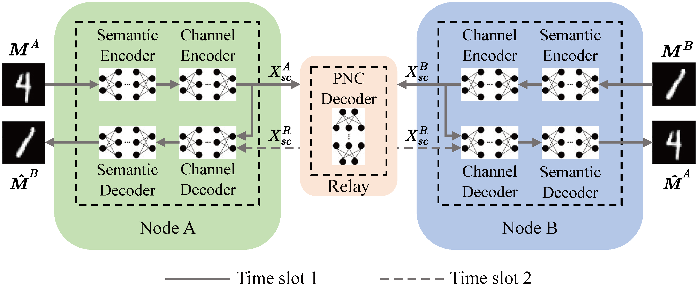

# SC-PNC TWRC

This is the code for paper [Semantic Communication Empowered Physical-layer Network Coding](https://arxiv.org/abs/2209.00791). The model is implemented with TensorFlow. 

# Usage
The basic settings are contained in `options/base_options.py`, `options/train_options.py`, and `options/test_options.py`. 

## Training

    usage: train.py [-h] [--image_height IMAGE_HEIGHT]
                     [--image_width IMAGE_WIDTH]
                     [--image_channel IMAGE_CHANNEL]
                     [--val_rate VAL_RATE]
                     [--num_symbol_node NUM_SYMBOL_NODE]
                     [--num_symbol_relay NUM_SYMBOL_RELAY]
                     [--channel_type CHANNEL_TYPE]
                     [--snr_train_dB_up SNR_TRAIN_DB_UP]
                     [--snr_train_dB_down SNR_TRAIN_DB_DOWN]
                     [--num_epochs NUM_EPOCHS]
                     [--batch_size BATCH_SIZE]
                     [--lr LR]
                     [--lr_decay LR_DECAY]
Example usage:

    python train_dyna.py --snr_train_dB_up 5 --num_epochs 50 --lr 1e-3

## Testing

Example usage:

    python test_phase.py
    python test_snr.py

## Reference

    @misc{yang2022semantic,
      title = {Semantic Communication-Empowered Physical-layer Network Coding},
      author = {Yang, Shuai and Pan, Haoyuan and Chan, Tse-Tin and Wang, Zhaorui},
      publisher = {arXiv},
      year = {2022},
      url = {https://arxiv.org/abs/2209.00791},
      copyright = {arXiv.org perpetual, non-exclusive license}
    }
